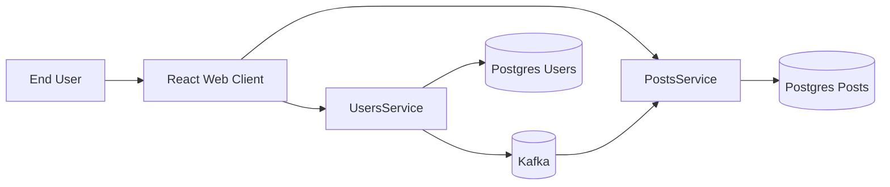
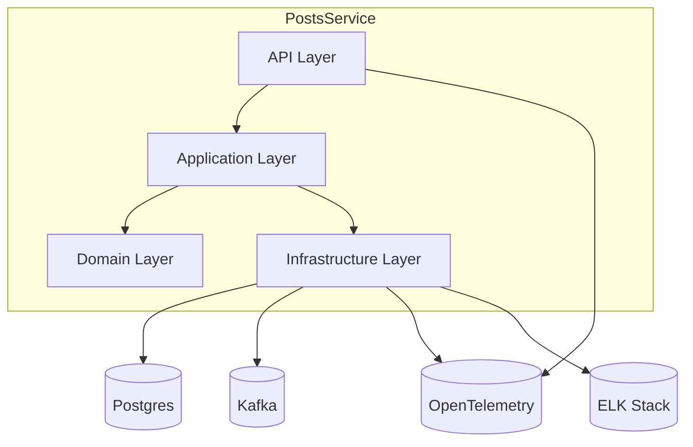
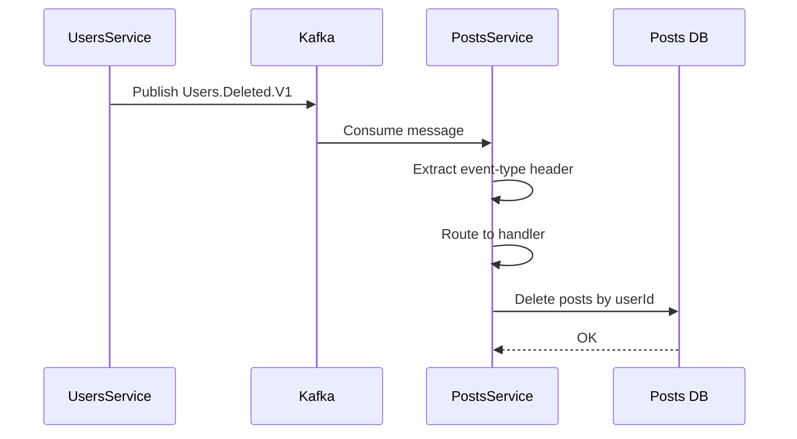
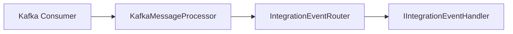
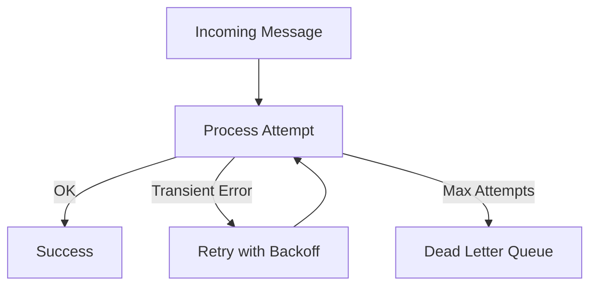

# Widler

## Общая идея проекта

Данный проект задуман как **практическая демонстрация архитектурных и инфраструктурных best practices при разработке микросервисных систем**.

Основной фокус сделан **на техническую реализацию**, архитектуру, взаимодействие сервисов и эксплуатационные аспекты (observability, reliability, scalability), а не на сложную бизнес-логику.

Проект оформлен как **монорепозиторий** и будет постепенно развиваться по мере накопления новых архитектурных решений, паттернов и улучшений в отдельных сервисах.

---

## Состав системы

На текущий момент система состоит из следующих компонентов:

### Backend микросервисы

1. **UsersService**  
   ASP.NET Core Web API микросервис, отвечающий за управление пользователями.
   
   **Ключевые особенности:**
   - CRUD-операции над пользователями
   - Собственная БД: `PostgreSQL (postgres_users)`
   - Интеграция с Kafka
   - Версионирование API
   - Swagger / OpenAPI
   - Структурированное логирование: **Serilog → Filebeat → Elasticsearch → Kibana**
   - Метрики и телеметрия
   - Distributed tracing

2. **PostsService**  
   ASP.NET Core Web API микросервис, отвечающий за управление постами пользователей.
   
   **Ключевые особенности:**
   - CRUD-операции над постами
   - Реакция на интеграционные события других сервисов
   - Собственная БД: `PostgreSQL (postgres_posts)`
   - Интеграция с Kafka
   - Версионирование API
   - Swagger / OpenAPI
   - Структурированное логирование: **Serilog → Filebeat → Elasticsearch → Kibana**
   - Метрики, телеметрия и трассировка

### Frontend

3. **ReactWebClient**  
   Веб-клиент на React.

   - React + Vite
   - Vite proxy для локальной разработки
   - Nginx для запуска в контейнере
   - Тестовая страница генерации данных для проверки API и межсервисного взаимодействия

### Инфраструктура

4. PostgreSQL для UsersService  
5. PostgreSQL для PostsService  
6. Kafka (Redpanda)
7. Elasticsearch + Filebeat + Kibana
8. Prometheus + Grafana
9. Jaeger
10. Прочие вспомогательные сервисы и утилиты

Вся система запускается в контейнерах с помощью **Docker Compose**.

---

## System Context



**Ключевые моменты:**

- Сервисы **не зависят друг от друга синхронно**
- Межсервисное взаимодействие построено через **integration events**
- Kafka используется как **integration backbone**, а не как RPC-транспорт

---
Первоначально новые изменения вносятся в **PostsService**, поэтому описание архитектурных принципов и паттернов приводится именно на его примере.
---

# PostsService

## Назначение сервиса

`PostsService` — микросервис, отвечающий за управление постами пользователей.

Сервис спроектирован как **event-driven компонент системы** и реагирует на доменные и интеграционные события, публикуемые другими сервисами (например, удаление пользователя).

### Основные цели сервиса

- CRUD-операции с постами
- Реакция на внешние интеграционные события
- Асинхронное взаимодействие через брокер сообщений
- Изоляция доменной логики от инфраструктуры

---

## Архитектурные принципы и паттерны

### 1. Clean Architecture / Onion Architecture

Проект структурирован по слоям:

- **Domain**
  - Доменные сущности
  - Бизнес-правила
  - Не имеет зависимостей от инфраструктуры

- **Application**
  - Use-cases
  - Обработчики команд и событий
  - Оркестрация бизнес-логики

- **Infrastructure**
  - Kafka
  - Работа с базой данных
  - Внешние интеграции

- **API**
  - HTTP-контроллеры
  - Hosted services
  - Конфигурация Dependency Injection

**Ключевой принцип:** зависимости направлены внутрь — инфраструктура зависит от домена, а не наоборот.

---

### 2. CQRS (Command Query Responsibility Segregation)

Используется разделение ответственности между:

- **Commands** — изменяют состояние системы
- **Queries** — только читают данные

Это упрощает:
- тестирование
- эволюцию модели
- масштабирование

---

### 3. Event-Driven Architecture

Взаимодействие между сервисами осуществляется асинхронно через Kafka.

`PostsService` подписывается на Kafka-топики и обрабатывает **integration events**, публикуемые другими сервисами.

**Пример сценария:**
- `UsersService` публикует событие `Users.Deleted.V1`
- `PostsService` получает событие и удаляет все посты пользователя

---

### Container Diagram



---

### 4. Integration Events и версионирование

Используется явное разделение:

- **Integration Event Name** — строковый контракт (например, `Users.Deleted.V1`)
- **Integration Event DTO** — версия события (`V1`, `V2`, ...)
- **Handler** — отдельный обработчик для каждого события

```
Users.Deleted.V1
└── UserDeletedV1
    └── UserDeletedIntegrationEventHandler
```

Такой подход позволяет:
- версионировать события
- изменять контракты без breaking changes
- изолировать обработку событий

---

## Integration Event Flow



---

## Event Routing



### 5. Event Routing

Используется централизованный роутер событий:

- строковый `eventType` сопоставляется с CLR-типом события
- единая точка маршрутизации
- отсутствие `switch/case` и `if/else` в consumer'ах

Преимущества:
- соблюдение **Open/Closed Principle**
- добавление новых событий без изменения существующего кода

---

### 6. Надёжность: Retries и Dead Letter Queue (DLQ)




- Повторные попытки обработки сообщений
- Выделенный DLQ-топик для сообщений, которые не удалось обработать
- Защита от бесконечных retry-циклов

---

### 7. Idempotency

Обработка событий спроектирована таким образом, что повторное получение сообщения:

- не ломает данные
- не приводит к неконсистентному состоянию системы

---

### 8. Dependency Injection и расширяемость

Все обработчики и инфраструктурные компоненты регистрируются через DI.

Используется контрактный подход:
- `IIntegrationEventHandler<T>`
- `IKafkaProducer`
- `IKafkaMessageProcessor`

Это упрощает:
- тестирование
- подмену инфраструктурных компонентов
- расширение системы

---

### 9. Логирование и наблюдаемость

- Структурированное логирование
- Явное логирование:
  - получения сообщений
  - маршрутизации событий
  - игнорирования неизвестных `eventType`
- Логи ориентированы на диагностику в распределённой среде

---
